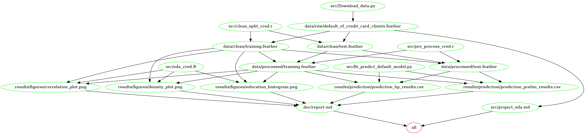

# Credit Card Default Predictor
Authors: Hazel Jiang, Lara Habashy, Selma Duric

UBC Master of Data Science program, DSCI 522 data analysis project.

## About
We attempt to predict if a person in Taiwan would default on a credit card payment given information about their past payment history, credit card limit as well as personal characteristics such as age, gender, education, and marital status.

The data set for this project is sourced from the UCI Machine Learning Repository (Yeh, and Lien 2009) and can be [found here.](http://archive.ics.uci.edu/ml/datasets/default+of+credit+card+clients)

The dataset contains 30,000 observations representing individual customers in Taiwan. Each row contains relevant information about the individual as well as how timely they were with their bill payments and  the corresponding bill amounts for each time period. The bill payment information contains records from April 2005 to September 2005. The data was collected from an important cash and credit card issuing bank in Taiwan.

In the exploratory analysis portion, first we explore the data to observe any missing values or outliers. Next, we partition the data set into training and testing portions. We examine correlation amongst features and with the target response. Further, we investigate feature importance using various methods such as using a random forest classifier. The results are documented [here](https://github.com/UBC-MDS/DSCI522_group_12/blob/main/src/project_eda.md).

Our logistic regression classifier performed with a f1 score on the test data of 0.50. On the 7500 test data cases, it correctly predicted approximately 4500 default payments. However, many true default payments were not detected. As such, we continue to investigate methods to improve the model's accuracy.

## Report
The final report can be found [here](https://github.com/UBC-MDS/DSCI522_group_12/blob/main/doc/report.md).

## Usage
To replicate this analysis, clone the GitHub repository, install dependencies and run the following commands from the root directory of this project:

**Option 1: Using Docker**

If you have Docker installed, you may run the commands as follows:

- To execute the scripts in the src directory and generate the reports, in terminal type:
`docker run --rm -v /$(pwd):/home/rstudio/data_analysis sduric/default_prediction make -C /home/rstudio/data_analysis/ all`

- To clear the generated files and reset the repo, type:
`docker run --rm -v /$(pwd):/home/rstudio/data_analysis sduric/default_prediction make -C /home/rstudio/data_analysis/ clean`

Note: the above instructions assume use of Unix shell. 

**Option 2: Without using Docker**

- Type `make all` from command line to execute scripts in the src directory.
- To clear the generated files and reset the repo, type `make clean` from command line to clean and remove the results directory.

The makefile is comprised of the following:

## Dependencies
- Python 3.8.3 and Python packages:
    - docopt=0.6.2
    - pandas=1.0.5
    - xlrd=1.2.0
    - pyarrow=2.0.0
    - scikit-learn=0.20.4
    - scipy=1.5.2
    - arrow=2.0.0
    - feather-format=0.4
    
- R version 4.0.2 and R packages:
    - knitr=1.29
    - tidyverse=1.3.0
    - caret=6.0.86
    - readxl=1.3.1
    - pacman=0.5.1
    - feather=0.3.5
    - janitor=2.0.1
    - ggthemes=4.2.0
    - ggcorrplot=0.1.3
    - here=1.0.0
    - PerformanceAnalytics=2.0.4
    - GGally=2.0.0
    - FSinR=2.0.5
    - ggpubr=0.4.0
    - VSURF=1.1.0

## License
The materials here are licensed under the MIT License(Copyright (c) 2020 GROUP 12). If you are re-using the materials, please provide attribution and link to this webpage. 

# References
Yeh, I. C., and Lien, C. H. 2009. “UCI Machine Learning Repository.” University of California, Irvine, School of Information; Computer Sciences. http://archive.ics.uci.edu/ml.

Yeh, I. and Lien, C., 2009. The comparisons of data mining techniques for the predictive accuracy of probability of default of credit card clients. Expert Systems with Applications, 36(2), pp.2473-2480.
