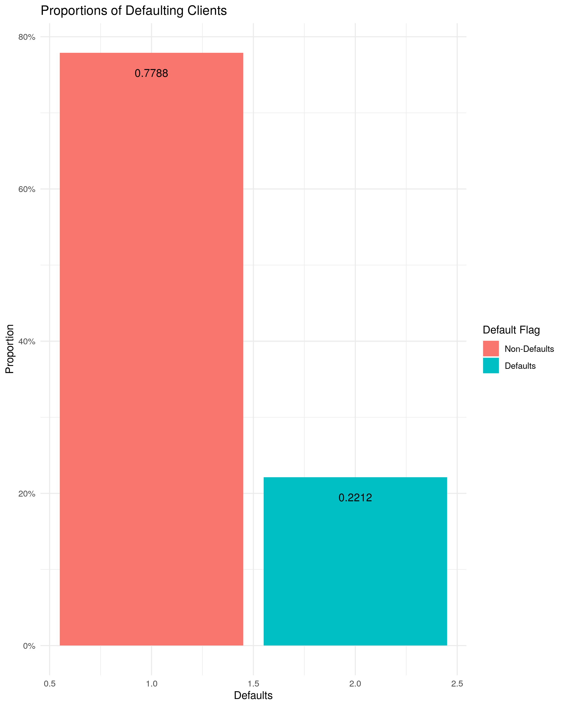
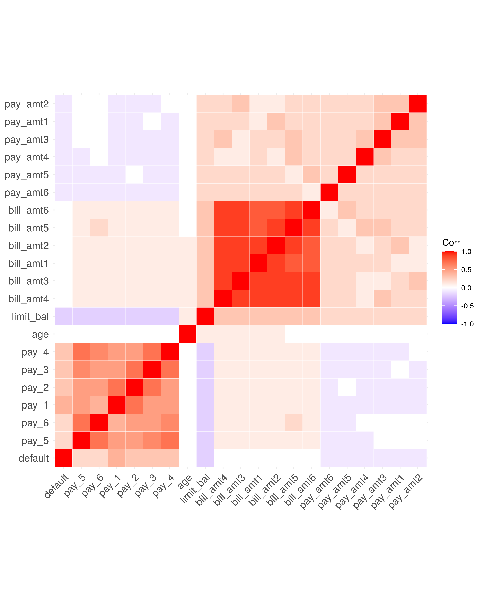
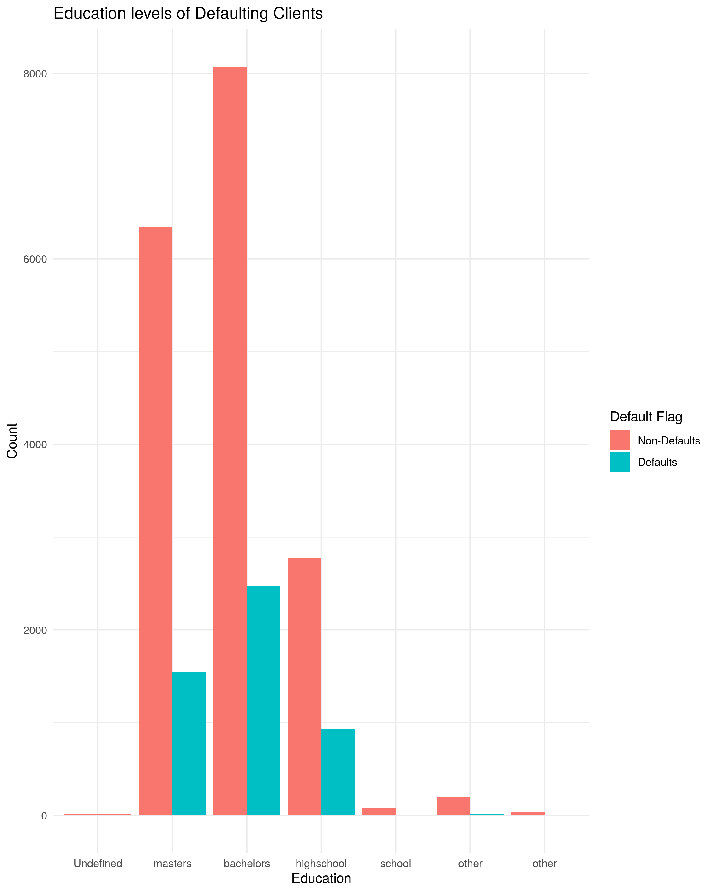
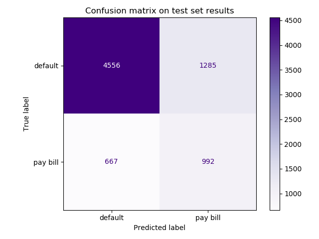

Credit Card Default Prediction
================
Selma Duric, Lara Habashy, Hazel Jiang 
12/12/2020

  - [Summary](#summary)
  - [Introduction](#introduction)
  - [Methods](#methods)
      - [Data](#data)
      - [Analysis](#analysis)
  - [Results & Discussion](#results-discussion)
  - [References](#references)

## Summary

Here we attempt to apply two machine learning models
`LogisticRegression` and `RandomForest` on a credit card default data
set to predict whether the customer will default on the credit card
payment for the next month in order to lower the risk for banks to issue
credit card to more reliable clients. The result indicates that
`LogisticRegression` with optimized hyperparameter
`class_weight='balanced'` and `C=382` is the best performing model. We
get f1 score of xxx for prediction on test data. It is a fair score but
there is room for improvement. We suggest future research to apply
feature engineering and to obtain more data for a better predication
accuracy.

## Introduction

In recent years, credit card becomes more and more popular in Taiwan.
Because card-issuing banks are all trying to increase market share,
there exists more unqualified applicants who are not able to pay their
credit card on time. This behavior is very harmful to both banks and
cardholders.(Yeh and Lien 2009) It is always better to prevent than to
solve a problem. By detecting patterns of people who tend to default
their credit card payment, banks are able to minimize the risk of
issuing credit card to people who may not be able to pay on time.

Here we would like to use a machine learning algorithm to predict
whether a person is going to default on his/her credit card payment. We
plan to try both `Logistic Regression` and `Random Forest` on the
training data with default parameter and optimized hyperparameters. We
will pick the best performing model with optimized hyperparameters to
predict on the test data. Thus, if the machine learning algorithm can
make accurate prediction, banks are able to find reliable applicants and
minimize their loss on default payment.

## Methods

### Data

The dataset we are using in the project is originally from Department of
Information Management in Chun Hua University, Taiwan and Department of
Civil Engineering in Tamkang University, Taiwan. It was sourced from UCI
Machine Learning Repository and can be found
[here](http://archive.ics.uci.edu/ml/datasets/default+of+credit+card+clients#).
Specifically, [This
file](http://archive.ics.uci.edu/ml/machine-learning-databases/00350/default%20of%20credit%20card%20clients.xls)
is what we used to build the model. This dataset has information on
default payments of credit card in Taiwan from April to September 2005.
There are 30,000 observations of distinct credit card clients in this
data set with each row representing a unique client. There are 25
variables in total(24 features and 1 target). Within the 24 features, 23
of them are useful features for the prediction (we will drop `ID` column
since it is irrelevant to the prediction). Our target is
`default.payment.next.month` column. There are 2 classes in the column,
with `class 0` representing a client paying their next bill and
`class 1` representing a clent defaulting on their next bill payment. We
notice there exists class imbalance in the target column. 77.9% of the
examples belong to `class 1` and only 22.1% of examples belong to
`class 0`. Because we are interested to find customers who are likely to
default on their payment, predicting `class 1` correctly is more
imortant to us rather than getting a good accuracy score. With a high
accuracy score, we may miss potentially high amounts of false positives
or negatives which would include customers who we predict will not
default when they actually will. For this reason, we care more about the
recall score. At the same time, precision score is also very important
because if we predict customers to the wrong class, it my hurt customer
loyalty. Therefore, considering the importance of both recall and
precision, we have chosen f1 score as our metrics for assessment. Below
is a graph indicating the class imbalance in our target.

Figure 1: Class imbalance on target

### Analysis

Based on the description of the dataset, we divided features into 2
types: numerical features and categorical features. In terms of
numerical features, for each individual we have the prior 6 months of
monthly bill amounts(measured in Taiwanese currency) as well as the
history of payment. The features labelled as `PAY_0`, `PAY_2`…`PAY_6`
represents the delay in repayment in months where a larger value
indicates slower repayment. Furthermore, we also have credit card limit
(`LIMIT_BAL`) and `AGE` as our numerical features. We examined the
correlation between all the numerical features and the target, based on
the plot we found that credit limit is likely to be negative correlated
to the target and age is slightly positively correlated to the target.
Also, `BILL_AMT` features are negative correlated to our target, and the
older the `BILL_AMT`(compare to the due date), the less correlated it is
to the target.

Figure 2: Correlation between numeric features and target

In terms of categorical features, we have `SEX`, `EDUCATION` and
`MARRIAGE`. Based on the plot and data description, we have 6 categories
for `EDUCATION` with 1=graduate school, 2=university, 3=high school,
4=others and 5,6=unknown. The plot suggests that people with lower
levels of education may have a higher proportion of default payments as
compared to those with higher levels of education. However, we note that
we do have some categories that warrant further inspection of the data
to remove ambiguous categories such as ‘Other’ and "Unknown’. Without
further information, we believe this would have a minor effect on our
prediction accuracy but note this as a feature for further review.

Figure 3: Proportion of default payments for different education levels

A more comprehensive review and analysis of the data is available in our
EDA report including information about data transformation steps that
were taken. The EDA report can be found
[Here](https://github.com/UBC-MDS/DSCI522_group_12/blob/main/src/project_eda.md)

Both a linear classification model `LogisticRegression` and an ensemble
decision tree classification model. We compared their performance with
default parameters first then apply hyperparameter tuning.
Hyperparameter optimization was completed using a randomized search
method (scikit-learn’s `RandomSearchCV`) with 5 iterations and 5-fold
cross validation. The hyperparameters `class_weight` and `C` were
optimized for `Logistic Regression` and n\_estimators and max\_depth for
`Random Forest`. The R(R Core Team 2020) and Python(Van Rossum and Drake
2009) programming languages and the following R and Python packages were
used to perform the analysis: docopt(de Jonge 2018), feather(Wickham
2019), knitr(Xie 2020), tidyverse(Wickham 2017)and Pandas(team 2020).

The code used to perform the analysis and create this report can be
found [here](https://github.com/UBC-MDS/DSCI522_group_12/tree/main/src)

## Results & Discussion

To look at which model is better for prediction, we first compare the
two models with default hyperparameters. We used `DummyRegression` with
`strategy='prior'` as our baseline. Compare to the baseline, both
`RandomForest` and `LogisticRegression` has better score on f1(0.47 and
0.51 respectively). However, we also noticed that `RandomForest` has a
very high f1 on the training set, but the score is low on the validation
set, and there exists a huge gap between the two scores, which means we
have an overfitting problem.

| X1                         | Baseline | Random Forest | Logistic Regression |
| :------------------------- | -------: | ------------: | ------------------: |
| mean\_accuracy\_train      |   0.7788 |        0.9995 |              0.7449 |
| mean\_accuracy\_validation |   0.7788 |        0.8156 |              0.7442 |
| mean\_f1\_train            |   0.0000 |        0.9988 |              0.5126 |
| mean\_f1\_validation       |   0.0000 |        0.4694 |              0.5110 |

Table 1.Comparison between accuracy and f1 with default hyperparameters
on training set

Since the validation scores were comparable, we then tune
hyperparameters for both models and compare the results. As indicated in
the results table below, our best f1 score on cross-validation is 0.51.
The best performing model is `Logistic Regression` with
`class_weight='balanced'` and `C=382`.

| mean f1 score | params                                     | model              |
| ------------: | :----------------------------------------- | :----------------- |
|     0.5105100 | {‘C’: 382, ‘class\_weight’: ‘balanced’}    | LogisticRegression |
|     0.5104636 | {‘C’: 559, ‘class\_weight’: ‘balanced’}    | LogisticRegression |
|     0.5104191 | {‘C’: 679, ‘class\_weight’: ‘balanced’}    | LogisticRegression |
|     0.4753636 | {‘max\_depth’: 560, ‘n\_estimators’: 94}   | RandomForest       |
|     0.4747108 | {‘max\_depth’: 946, ‘n\_estimators’: 161}  | RandomForest       |
|     0.4733365 | {‘max\_depth’: 1793, ‘n\_estimators’: 168} | RandomForest       |
|     0.4714657 | {‘max\_depth’: 1408, ‘n\_estimators’: 43}  | RandomForest       |
|     0.4494986 | {‘max\_depth’: 736, ‘n\_estimators’: 20}   | RandomForest       |
|     0.3958155 | {‘C’: 158, ‘class\_weight’: ‘none’}        | LogisticRegression |
|     0.3958155 | {‘C’: 596, ‘class\_weight’: ‘none’}        | LogisticRegression |

Table 2. F1 score with optimized hyperpamaters for each model

With the best performing model, we tried to predict on our test data and
the f1 score on the test set is xxx. Based on the result above, we find
that although `LogisticRegression` is the better model to use between
the two, the f1 score is only around 0.5 which suggests that there is
still a lot of errors in prediction.

Figure 4: Confusion matrix for LogistricRegression

If we look at the confusion matrix from the test set, we can see that of
7,500 examples, the model predicted slightly less than 75% of these
correctly. However, we also note that it falsely predicted that more
than 1,200 customers (15%) would pay their next bill when in fact they
would not. This is important as if this model were to be used by a bank,
it would not flag these customers for intervention. The more than 600
customers that were predicted to default when they actually would not is
a less risky error. A 15% ‘miss’ rate is a substantial error that may
not make this model acceptable for deployment as a prediction tool.

With the above in mind, we propose some future improvements to the
model. One improvement is to perform feature engineering. We only have
23 features for the model to learn, which is very limited for problem
like this. Future research may consider to create new features that
would help the model to better learn the pattern, or if possible, to
gather from customers such as ccupation, known net asset value, bank
account value, number of credit cards, etc. A second improvement is to
look at obtaining more data. The data currently is limited to a very
small population (banks in Taiwan) over a short period of time (6 months
in 2005). By expanding this over more countries and over additional
years may allow for the inclusion features that capture external events
such as recessions and other economic events that may be more predictive
of defaults.

## References

de Jonge, Edwin. 2018. *Docopt: Command-Line Interface Specification
Language*. <https://CRAN.R-project.org/package=docopt>.

R Core Team. 2020. *R: A Language and Environment for Statistical
Computing*. Vienna, Austria: R Foundation for Statistical Computing.
<https://www.R-project.org/>.

team, The pandas development. 2020. *Pandas-Dev/Pandas: Pandas* (version
1.1.1). Zenodo. <https://doi.org/10.5281/zenodo.3993412>.

Van Rossum, Guido, and Fred L. Drake. 2009. *Python 3 Reference Manual*.
Scotts Valley, CA: CreateSpace.

Wickham, Hadley. 2017. *Tidyverse: Easily Install and Load the
’Tidyverse’*. <https://CRAN.R-project.org/package=tidyverse>.

———. 2019. *Feather: R Bindings to the Feather ’Api’*.
<https://CRAN.R-project.org/package=feather>.

Xie, Yihui. 2020. *Knitr: A General-Purpose Package for Dynamic Report
Generation in R*. <https://yihui.org/knitr/>.

Yeh, I-Cheng, and Che-hui Lien. 2009. “The Comparisons of Data Mining
Techniques for the Predictive Accuracy of Probability of Default of
Credit Card Clients.” *Expert Systems with Applications* 36 (2):
2473–80.

