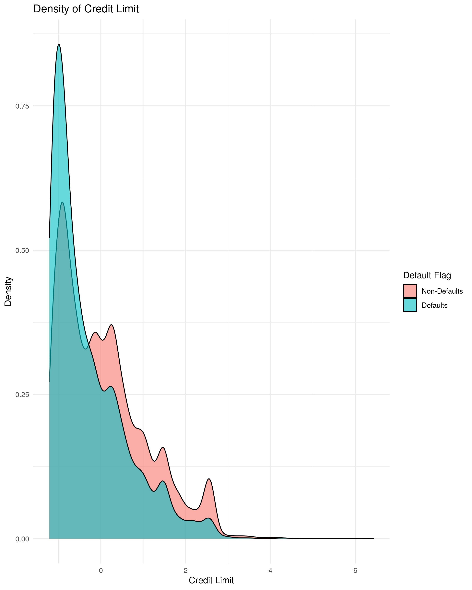

## Summary

Here we attempt to apply two machine learning models
`LogisticRegression` and `RandomForest` on a credit card default data
set and find the better model with optimized hyperparameter to predict
if a client is likely to default payment on the credit card in order to
lower the risk for banks to issue credit card to more reliable clients.
`LogisticRegression` performed better compared to `RandomForest`. Our
best prediction has f1 score of 0.51 with optimzed hyperpameter of
*C=382* and *class\_weight=‘balanced’*.

## Introduction

In recent years, credit card becomes more and more popular in Taiwan.
Because card-issuing banks are all trying to increase market share,
there exists more unqualified applicants who are not able to pay their
credit card on time. This behavior is very harmful to both banks and
cardholders.(Yeh and Lien 2009) It is always better to prevent than to
solve a problem. By detecting patterns of people who tend to default
their credit card payment, banks are able to minimize the risk of
issuing credit card to people who may not be able to pay on time.

Here we would like to use a machine learning algorithm to predict
whether a person is going to default on his/her credit card payment. We
are going to test on different model and hyperparameters to find the
best score on prediction. With the model, banks could predict if the
applicant has the ability to pay on time and make better decision on
whether to issue the person a credit card. Thus, if the machine learning
algorithm can make accurate prediction, banks are able to find reliable
applicants and minimize their loss on default payment.

## Methods

### Data

The dataset we are using in the project is originally from Department of
Information Management in Chun Hua University, Taiwan and Department of
Civil Engineering in Tamkang University, Taiwan. It was sourced from UCI
Machine Learning Repository and can be found
[here](http://archive.ics.uci.edu/ml/datasets/default+of+credit+card+clients#).
[This
file](http://archive.ics.uci.edu/ml/machine-learning-databases/00350/default%20of%20credit%20card%20clients.xls)
is what we used to build the model. The data set contains 30,000
observations representing individual customers in Taiwan. Each row
contains relevant information about the distinct individual as well as
how timely they were with their bill payments and the corresponding bill
amounts for each time period. The bill payment information contains
records from April 2005 to September 2005 and each individual have the
same number of time periods. The data was collected from an important
cash and credit card issuing bank in Taiwan. We will make our prediction
based on the features given by the data.

### Analysis

There are 30,000 observations of distinct credit card clients in this
data set with each row representing a client. 25 different features are
included with information of each given client, such as gender, age,
approved credit limit, education, marital status, their past payment
history, bill statements, and previous payments for 6 months (April-Sept
2005). Feature transformations are applied to the given features so each
observation has the same number of time periods.
[Here](https://github.com/UBC-MDS/DSCI522_group_12/blob/main/src/project_eda.md)
is a more detailed exploratory analysis that explained how we transform
and use each feature. There exists class imbalance in the data set, and
one pattern we found is that people with higher credit card limit are
more likely to default their payment.

Figure 1. Density of Credit Limit Between Default Clients and On-time
Clients

Another pattern we found is that there exists a correlation between
education level and default payment. We will analyze this feature
further in our machine learning model.

Figure 2. Correlation Between Educational level and Default Payment

Both a linear classification model `LogisticRegression` and an ensemble
decision tree classification model `RandomForest` from
scikit-learn(Pedregosa et al. 2011) will be used to build this
classification model to see which better predicts whether a client will
default on the credit card payment. Because of the class imbalance we
have, we will look at test accuracy as well as f1 scores on both models.
For each model, the appropriate hyperparameters were chosen using 5-fold
cross validation. The R(R Core Team 2020) and Python(Van Rossum and
Drake 2009) programming languages and the following R and Python
packages were used to perform the analysis: docopt(de Jonge 2018),
feather(Wickham 2019), knitr(Xie 2020), tidyverse(Wickham 2017)and
Pandas(team 2020).

The code used to perform the analysis and create this report can be
found [here](https://github.com/UBC-MDS/DSCI522_group_12/tree/main/src)

## Results & Discussion

To look at which model is better for prediction, we first compare the
two models with default hyperparameters. We used `DummyRegression` with
`strategy='prior'` as our baseline. Although it has an accuracy score of
0.78, it is not very reliable because we have class imbalance in the
data set and f1 score is more important in our prediction. Our baseline
has f1 score of 0, which is not good. On the other hand, both
`RandomForest` and `LogisticRegression` has better score on f1.
`RandomForest` has a very high f1 on the training set, but the score is
low on the validation set, and there exists a huge gap between the two
scores, which means we have an overfitting problem. On the other hand,
`LogisticRegression` has very similar training and validation f1 scores,
it has a higher f1 score compared to `RandomForest` model. Therefore, we
believe `LogisticRegression` is a better model to use for prediction.

<table>
<caption>Table 1.Comparison between accuracy and f1 with default hyperparameters for each model</caption>
<thead>
<tr class="header">
<th style="text-align: left;">X1</th>
<th style="text-align: right;">Baseline</th>
<th style="text-align: right;">Random Forest</th>
<th style="text-align: right;">Logistic Regression</th>
</tr>
</thead>
<tbody>
<tr class="odd">
<td style="text-align: left;">mean_accuracy_train</td>
<td style="text-align: right;">0.7788</td>
<td style="text-align: right;">0.9995</td>
<td style="text-align: right;">0.7448</td>
</tr>
<tr class="even">
<td style="text-align: left;">mean_accuracy_validation</td>
<td style="text-align: right;">0.7788</td>
<td style="text-align: right;">0.8155</td>
<td style="text-align: right;">0.7440</td>
</tr>
<tr class="odd">
<td style="text-align: left;">mean_f1_train</td>
<td style="text-align: right;">0.0000</td>
<td style="text-align: right;">0.9988</td>
<td style="text-align: right;">0.5125</td>
</tr>
<tr class="even">
<td style="text-align: left;">mean_f1_validation</td>
<td style="text-align: right;">0.0000</td>
<td style="text-align: right;">0.4707</td>
<td style="text-align: right;">0.5108</td>
</tr>
</tbody>
</table>

Table 1.Comparison between accuracy and f1 with default hyperparameters
for each model

Since the validation scores were comparable, we decided to tune
hyperparameters for both models and compare the results with the
previous table. The hyperparameters we chose for `RandomForest` is
`n_estimators` (low=10, high=300) and `max_depth` (low=1, high=5000).
The hyperparameters for `LogisticRegression` is `class_weight`
(“balanced” vs “none”) and `C` (low=0, high=1000). We only focus on f1
score in this comparasion since it is more relavant to the issue we care
about. We ranked the f1 score from high to low. As indicated in the
table, our best f1 score is 0.51 with hyperparameter *C=382* and
*class\_weight=‘balanced’*. The results also show that the top 3 f1
scores are all come from `LogisricRegression`. This finding further
confirmed our results from previous table that `LogisticRegression` is a
better model to use than `RandomForest`.

<table>
<caption>Table 2. F1 score with optimized hyperpamaters for each model</caption>
<thead>
<tr class="header">
<th style="text-align: right;">mean f1 score</th>
<th style="text-align: left;">params</th>
<th style="text-align: left;">model</th>
</tr>
</thead>
<tbody>
<tr class="odd">
<td style="text-align: right;">0.5104704</td>
<td style="text-align: left;">{‘C’: 559, ‘class_weight’: ‘balanced’}</td>
<td style="text-align: left;">LogisticRegression</td>
</tr>
<tr class="even">
<td style="text-align: right;">0.5103458</td>
<td style="text-align: left;">{‘C’: 382, ‘class_weight’: ‘balanced’}</td>
<td style="text-align: left;">LogisticRegression</td>
</tr>
<tr class="odd">
<td style="text-align: right;">0.5102955</td>
<td style="text-align: left;">{‘C’: 679, ‘class_weight’: ‘balanced’}</td>
<td style="text-align: left;">LogisticRegression</td>
</tr>
<tr class="even">
<td style="text-align: right;">0.4776511</td>
<td style="text-align: left;">{‘max_depth’: 1793, ‘n_estimators’: 168}</td>
<td style="text-align: left;">RandomForest</td>
</tr>
<tr class="odd">
<td style="text-align: right;">0.4746316</td>
<td style="text-align: left;">{‘max_depth’: 946, ‘n_estimators’: 161}</td>
<td style="text-align: left;">RandomForest</td>
</tr>
<tr class="even">
<td style="text-align: right;">0.4704937</td>
<td style="text-align: left;">{‘max_depth’: 1408, ‘n_estimators’: 43}</td>
<td style="text-align: left;">RandomForest</td>
</tr>
<tr class="odd">
<td style="text-align: right;">0.4666232</td>
<td style="text-align: left;">{‘max_depth’: 560, ‘n_estimators’: 94}</td>
<td style="text-align: left;">RandomForest</td>
</tr>
<tr class="even">
<td style="text-align: right;">0.4494723</td>
<td style="text-align: left;">{‘max_depth’: 736, ‘n_estimators’: 20}</td>
<td style="text-align: left;">RandomForest</td>
</tr>
<tr class="odd">
<td style="text-align: right;">0.3958155</td>
<td style="text-align: left;">{‘C’: 158, ‘class_weight’: ‘none’}</td>
<td style="text-align: left;">LogisticRegression</td>
</tr>
<tr class="even">
<td style="text-align: right;">0.3958155</td>
<td style="text-align: left;">{‘C’: 596, ‘class_weight’: ‘none’}</td>
<td style="text-align: left;">LogisticRegression</td>
</tr>
</tbody>
</table>

Table 2. F1 score with optimized hyperpamaters for each model

Based on the result above, we find that although `LogisticRegression` is
a better model to use, the f1 score is only around 0.5. It is not a very
good score, which means the prediction from this model is not as
reliable. To further improve this model in future, it is a good idea to
take consideration of other hyperparameters or apply feature engineering
to add more useful features to help with prediction. Furthermore, we may
also want to look at the confusion matrix of model performance and try
to minimize the false negative in the prediction by changing the
threshold of the model.

## References

de Jonge, Edwin. 2018. *Docopt: Command-Line Interface Specification
Language*. <https://CRAN.R-project.org/package=docopt>.

R Core Team. 2020. *R: A Language and Environment for Statistical
Computing*. Vienna, Austria: R Foundation for Statistical Computing.
<https://www.R-project.org/>.

team, The pandas development. 2020. *Pandas-Dev/Pandas: Pandas* (version
1.1.1). Zenodo. <https://doi.org/10.5281/zenodo.3993412>.

Van Rossum, Guido, and Fred L. Drake. 2009. *Python 3 Reference Manual*.
Scotts Valley, CA: CreateSpace.

Wickham, Hadley. 2017. *Tidyverse: Easily Install and Load the
’Tidyverse’*. <https://CRAN.R-project.org/package=tidyverse>.

———. 2019. *Feather: R Bindings to the Feather ’API’*.
<https://CRAN.R-project.org/package=feather>.

Xie, Yihui. 2020. *Knitr: A General-Purpose Package for Dynamic Report
Generation in r*. <https://yihui.org/knitr/>.

Yeh, I-Cheng, and Che-hui Lien. 2009. “The Comparisons of Data Mining
Techniques for the Predictive Accuracy of Probability of Default of
Credit Card Clients.” *Expert Systems with Applications* 36 (2):
2473–80.
