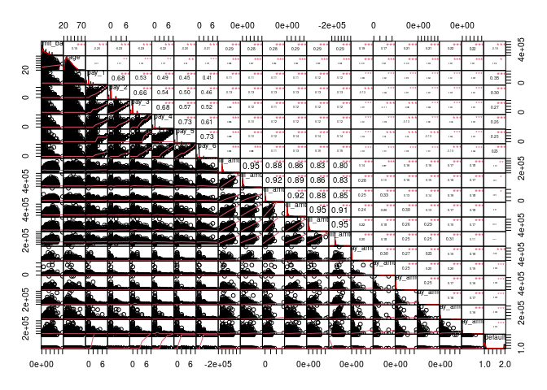
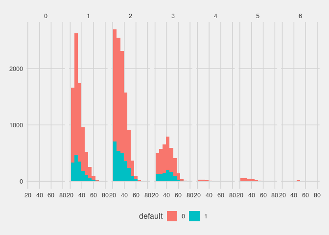
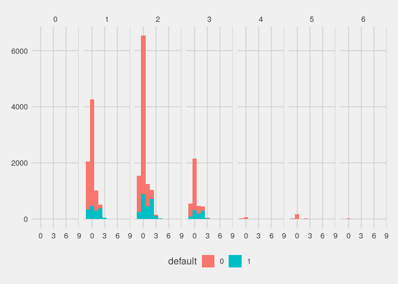
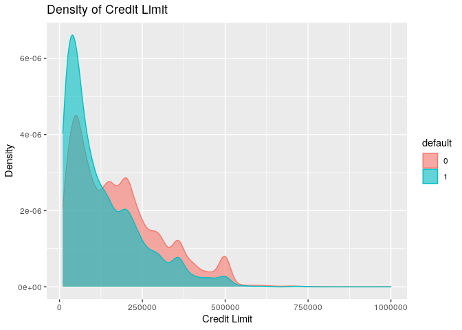
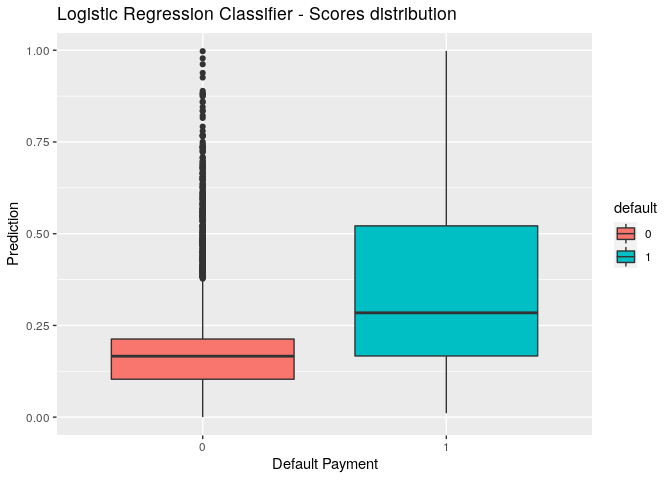
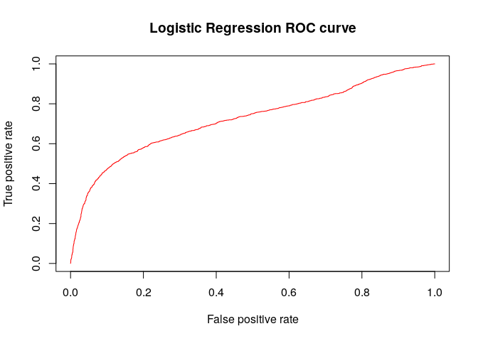

# Load the data & Preliminary Analysis

    ## # A tibble: 6 x 25
    ##   ID    LIMIT_BAL SEX   EDUCATION MARRIAGE AGE   PAY_0 PAY_2 PAY_3 PAY_4 PAY_5
    ##   <chr> <chr>     <chr> <chr>     <chr>    <chr> <chr> <chr> <chr> <chr> <chr>
    ## 1 1     20000     2     2         1        24    2     2     -1    -1    -2   
    ## 2 2     120000    2     2         2        26    -1    2     0     0     0    
    ## 3 3     90000     2     2         2        34    0     0     0     0     0    
    ## 4 4     50000     2     2         1        37    0     0     0     0     0    
    ## 5 5     50000     1     2         1        57    -1    0     -1    0     0    
    ## 6 6     50000     1     1         2        37    0     0     0     0     0    
    ## # … with 14 more variables: PAY_6 <chr>, BILL_AMT1 <chr>, BILL_AMT2 <chr>,
    ## #   BILL_AMT3 <chr>, BILL_AMT4 <chr>, BILL_AMT5 <chr>, BILL_AMT6 <chr>,
    ## #   PAY_AMT1 <chr>, PAY_AMT2 <chr>, PAY_AMT3 <chr>, PAY_AMT4 <chr>,
    ## #   PAY_AMT5 <chr>, PAY_AMT6 <chr>, `default payment next month` <chr>

    ## tibble [30,000 × 25] (S3: tbl_df/tbl/data.frame)
    ##  $ ID                        : chr [1:30000] "1" "2" "3" "4" ...
    ##  $ LIMIT_BAL                 : chr [1:30000] "20000" "120000" "90000" "50000" ...
    ##  $ SEX                       : chr [1:30000] "2" "2" "2" "2" ...
    ##  $ EDUCATION                 : chr [1:30000] "2" "2" "2" "2" ...
    ##  $ MARRIAGE                  : chr [1:30000] "1" "2" "2" "1" ...
    ##  $ AGE                       : chr [1:30000] "24" "26" "34" "37" ...
    ##  $ PAY_0                     : chr [1:30000] "2" "-1" "0" "0" ...
    ##  $ PAY_2                     : chr [1:30000] "2" "2" "0" "0" ...
    ##  $ PAY_3                     : chr [1:30000] "-1" "0" "0" "0" ...
    ##  $ PAY_4                     : chr [1:30000] "-1" "0" "0" "0" ...
    ##  $ PAY_5                     : chr [1:30000] "-2" "0" "0" "0" ...
    ##  $ PAY_6                     : chr [1:30000] "-2" "2" "0" "0" ...
    ##  $ BILL_AMT1                 : chr [1:30000] "3913" "2682" "29239" "46990" ...
    ##  $ BILL_AMT2                 : chr [1:30000] "3102" "1725" "14027" "48233" ...
    ##  $ BILL_AMT3                 : chr [1:30000] "689" "2682" "13559" "49291" ...
    ##  $ BILL_AMT4                 : chr [1:30000] "0" "3272" "14331" "28314" ...
    ##  $ BILL_AMT5                 : chr [1:30000] "0" "3455" "14948" "28959" ...
    ##  $ BILL_AMT6                 : chr [1:30000] "0" "3261" "15549" "29547" ...
    ##  $ PAY_AMT1                  : chr [1:30000] "0" "0" "1518" "2000" ...
    ##  $ PAY_AMT2                  : chr [1:30000] "689" "1000" "1500" "2019" ...
    ##  $ PAY_AMT3                  : chr [1:30000] "0" "1000" "1000" "1200" ...
    ##  $ PAY_AMT4                  : chr [1:30000] "0" "1000" "1000" "1100" ...
    ##  $ PAY_AMT5                  : chr [1:30000] "0" "0" "1000" "1069" ...
    ##  $ PAY_AMT6                  : chr [1:30000] "0" "2000" "5000" "1000" ...
    ##  $ default payment next month: chr [1:30000] "1" "1" "0" "0" ...

    ##       ID             LIMIT_BAL             SEX             EDUCATION        
    ##  Length:30000       Length:30000       Length:30000       Length:30000      
    ##  Class :character   Class :character   Class :character   Class :character  
    ##  Mode  :character   Mode  :character   Mode  :character   Mode  :character  
    ##    MARRIAGE             AGE               PAY_0              PAY_2          
    ##  Length:30000       Length:30000       Length:30000       Length:30000      
    ##  Class :character   Class :character   Class :character   Class :character  
    ##  Mode  :character   Mode  :character   Mode  :character   Mode  :character  
    ##     PAY_3              PAY_4              PAY_5              PAY_6          
    ##  Length:30000       Length:30000       Length:30000       Length:30000      
    ##  Class :character   Class :character   Class :character   Class :character  
    ##  Mode  :character   Mode  :character   Mode  :character   Mode  :character  
    ##   BILL_AMT1          BILL_AMT2          BILL_AMT3          BILL_AMT4        
    ##  Length:30000       Length:30000       Length:30000       Length:30000      
    ##  Class :character   Class :character   Class :character   Class :character  
    ##  Mode  :character   Mode  :character   Mode  :character   Mode  :character  
    ##   BILL_AMT5          BILL_AMT6           PAY_AMT1           PAY_AMT2        
    ##  Length:30000       Length:30000       Length:30000       Length:30000      
    ##  Class :character   Class :character   Class :character   Class :character  
    ##  Mode  :character   Mode  :character   Mode  :character   Mode  :character  
    ##    PAY_AMT3           PAY_AMT4           PAY_AMT5           PAY_AMT6        
    ##  Length:30000       Length:30000       Length:30000       Length:30000      
    ##  Class :character   Class :character   Class :character   Class :character  
    ##  Mode  :character   Mode  :character   Mode  :character   Mode  :character  
    ##  default payment next month
    ##  Length:30000              
    ##  Class :character          
    ##  Mode  :character

The data set consists of 25 features and 1 discrete response variable
called `default_payment_next_month`. There are 30,000 observations of
distinct credit card clients. Each row has a unique identifier called
`ID`, representing a client. The other features include information
amount a given client such as gender, age, approved credit limit,
education, marital status, their past payment history, bill statements,
and previous payments for 6 months. The history of past payment over 6
months (April-Sept 2005) is given by the features `pay_0`, `pay_2`,
`pay_3`, …, `pay_6` which take on numeric values representing the delay
of the repayment in months, i.e. `pay_0`=1 means a client’s payment is 1
month late in September 2005, `pay_6`=2 would then mean a clients
payment was 2 months past payment in April 2005. A value of -1 is
assigned for payments made on time in a given month. Note that the
sequence is missing `pay_1`. We rename `pay_0` to `pay_1` for
consistency and simplicity. We notice some of those features take on a
value of -2, which is undocumented and therefore, we encode as 0.

Furthermore, the bill statements and previous payment monthly features
(Sept-April 2005) are measured in dollar amounts. The mean value for the
amount of a given credit card limit is $167,484. There is some imbalance
in the target class, as well as education level and marital status.
Further, the average age of clients is around 36. The target variable,
`default_payment_next_month` has a value of 1 including the client’s
payment is default and 0 for non default. For simplicity, we rename the
target feature to `default`. Note that the months are reversed for the
pay features. That is, `bill_amt1` and `pay_amt1` will correspond to
September 2005. However, in the past payment status features, the month
of September is represented by `pay_6`, and April 2005 by `pay_0` which
we rename to `pay_1` for consistency. The `id` feature is dropped as
it’s irrelavant for our application. Further, unique identifiers that
could be used to identify an individual would be dropped or decoded to
protect the privacy of the individuals involvded.

The `education` feature takes on one of 7 numeric values representing a
given client record education level. An education with value 1 is
assigned for clients with graduate degree, 2 for bachelors degrees, and
so on.

`marriage` takes on one of 3 values where a value of 1 indicates the
client’s marital status as married, 2 is single, and 3 is classified as
any other status. `sex` takes on numeric values as well, with 1
indicating the client is male and 2 indicating the client is female.

# Data Cleaning

Before diving into EDA, we convert features into the best format for our
application. We also explore any missing values and find none.
Therefore, no imputation is required. However, we can consider applying
a scaling transformation to the numeric features in the data set.

    ## NULL

    ## target
    ##      0      1 
    ## 0.7788 0.2212

# Partition the data set into training and test sets

Before splitting the data set into training (75%) and testing (25%)
sets, we inspect class balance to detect any imbalance in the target
class which we attempt to correct.

    ## train_counts
    ##      0      1 
    ## 0.7788 0.2212

    ## test_counts
    ##      0      1 
    ## 0.7788 0.2212

# Exploratory analysis on the training data set

## Correlation Analysis

Looking at the correlation plot, we see that the features `pay_1`, …,
`pay_6` are the most correlated with the target variable `default`.
Demographic features in general do not seem to be highly correlated with
our response but rather the features tracking the monthly bill amounts.
The lowest correlated feature is `limit_bal`, which we applying a
standardization transformation to before modeling.

## Feature Analysis

Next, we consider a feature selection method that allows for individual
evaluation of each feature. We apply the function selectKBest on the
full dataset to select a subset for modelling that utilizes the most
significant features. To determine an optimal number of features, or the
best k, that will yield that strongest predictive powers, we first look
at the value per features attribute of all the features in the model.
The top feature’s value, `bill_amt1` is seen to be 82.1% and the least
valuable feature. We consider selecting features with a value of
approximately at least 70%.

### Variable Importance

The first approach we take to evaluate variable importance uses accuracy
and gini importance.

    ## 
    ## Call:
    ##  randomForest(formula = default ~ ., data = training_data, ntree = 50,      mtry = 2, importance = TRUE) 
    ##                Type of random forest: classification
    ##                      Number of trees: 50
    ## No. of variables tried at each split: 2
    ## 
    ##         OOB estimate of  error rate: 18.98%
    ## Confusion matrix:
    ##       0    1 class.error
    ## 0 16542  981  0.05598356
    ## 1  3290 1687  0.66104079

    ## Confusion Matrix and Statistics
    ## 
    ##           Reference
    ## Prediction    0    1
    ##          0 5548 1091
    ##          1  293  568
    ##                                           
    ##                Accuracy : 0.8155          
    ##                  95% CI : (0.8065, 0.8242)
    ##     No Information Rate : 0.7788          
    ##     P-Value [Acc > NIR] : 3.135e-15       
    ##                                           
    ##                   Kappa : 0.353           
    ##                                           
    ##  Mcnemar's Test P-Value : < 2.2e-16       
    ##                                           
    ##             Sensitivity : 0.9498          
    ##             Specificity : 0.3424          
    ##          Pos Pred Value : 0.8357          
    ##          Neg Pred Value : 0.6597          
    ##              Prevalence : 0.7788          
    ##          Detection Rate : 0.7397          
    ##    Detection Prevalence : 0.8852          
    ##       Balanced Accuracy : 0.6461          
    ##                                           
    ##        'Positive' Class : 0               
    ## 

The importance of each variable in the random forest model is displayed
in the figure above. The importance function outputs a list of features,
along with their corresponding Mean Decrease Gini and Mean Decrease
Accuracy values. Mean Decrease Accuracy suggests that if the variable is
not important, then rearranging its values should not degrade the
model’s prediction accuracy. The features at the top of the figure have
the most predictive power in the model. Eliminating these features would
significantly decrease the predictive power of the model. Once again
here, we observe that demographic features has very little significance
in the data set.

The second approach we take to evaluate variable importance uses the R
package VSURF. The recently publish library (2019) implements a 3-step
feature selection process using random forests. For the sake of time,
the team has decided to omit the work on VSURF variable importance until
time permits.

Next we examine the distribution of the most and least important
features. The plot suggests `education`, an interesting feature, is
highly imbalanced. Most of the client’s that make up this data set have
education level 2 or 3 (university or high school), with about with
education level 4.

It seems clients with lower credit limit balance are more likely to
default the next payment.

### Modeling Logistic Regression

    ## 
    ## Call:
    ## glm(formula = default ~ ., family = binomial, data = training_data)
    ## 
    ## Deviance Residuals: 
    ##     Min       1Q   Median       3Q      Max  
    ## -3.4949  -0.6661  -0.5453  -0.3083   3.5584  
    ## 
    ## Coefficients:
    ##               Estimate Std. Error z value Pr(>|z|)    
    ## (Intercept) -1.430e+01  9.434e+01  -0.152 0.879479    
    ## limit_bal   -1.351e-06  1.789e-07  -7.550 4.35e-14 ***
    ## sex2        -1.189e-01  3.599e-02  -3.302 0.000958 ***
    ## education1   1.086e+01  9.433e+01   0.115 0.908370    
    ## education2   1.074e+01  9.433e+01   0.114 0.909318    
    ## education3   1.070e+01  9.433e+01   0.113 0.909714    
    ## education4   9.968e+00  9.434e+01   0.106 0.915850    
    ## education5   9.659e+00  9.434e+01   0.102 0.918448    
    ## education6   1.044e+01  9.434e+01   0.111 0.911863    
    ## marriage1    2.324e+00  8.576e-01   2.710 0.006731 ** 
    ## marriage2    2.153e+00  8.577e-01   2.510 0.012082 *  
    ## marriage3    2.214e+00  8.720e-01   2.539 0.011115 *  
    ## age          5.199e-03  2.175e-03   2.391 0.016820 *  
    ## pay_1        6.454e-01  2.455e-02  26.288  < 2e-16 ***
    ## pay_2        6.877e-02  2.685e-02   2.561 0.010426 *  
    ## pay_3        1.246e-01  2.806e-02   4.439 9.02e-06 ***
    ## pay_4        4.319e-02  3.139e-02   1.376 0.168931    
    ## pay_5        9.001e-02  3.359e-02   2.680 0.007361 ** 
    ## pay_6        9.510e-02  2.896e-02   3.284 0.001024 ** 
    ## bill_amt1   -4.552e-06  1.279e-06  -3.559 0.000372 ***
    ## bill_amt2    3.718e-06  1.645e-06   2.260 0.023805 *  
    ## bill_amt3    6.506e-07  1.458e-06   0.446 0.655498    
    ## bill_amt4    1.814e-07  1.547e-06   0.117 0.906689    
    ## bill_amt5   -1.736e-07  1.746e-06  -0.099 0.920803    
    ## bill_amt6   -1.190e-07  1.368e-06  -0.087 0.930646    
    ## pay_amt1    -1.136e-05  2.508e-06  -4.528 5.95e-06 ***
    ## pay_amt2    -5.846e-06  2.154e-06  -2.713 0.006659 ** 
    ## pay_amt3    -2.807e-06  2.026e-06  -1.386 0.165875    
    ## pay_amt4    -3.364e-06  2.184e-06  -1.540 0.123532    
    ## pay_amt5    -3.228e-06  2.069e-06  -1.560 0.118670    
    ## pay_amt6    -1.059e-06  1.438e-06  -0.736 0.461439    
    ## ---
    ## Signif. codes:  0 '***' 0.001 '**' 0.01 '*' 0.05 '.' 0.1 ' ' 1
    ## 
    ## (Dispersion parameter for binomial family taken to be 1)
    ## 
    ##     Null deviance: 23779  on 22499  degrees of freedom
    ## Residual deviance: 20484  on 22469  degrees of freedom
    ## AIC: 20546
    ## 
    ## Number of Fisher Scoring iterations: 11

The logistic regression classifier performed faily well on the test data
with accuracy of 0.82 and AUC score of 0.724. However, many default
payments were not detected. As such, we continue to investigate way to
improve the models accuracy.
